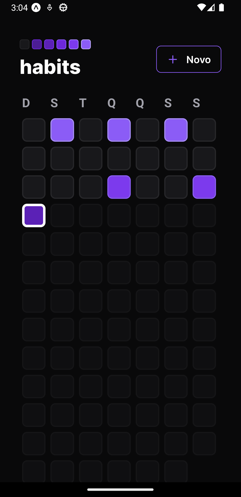
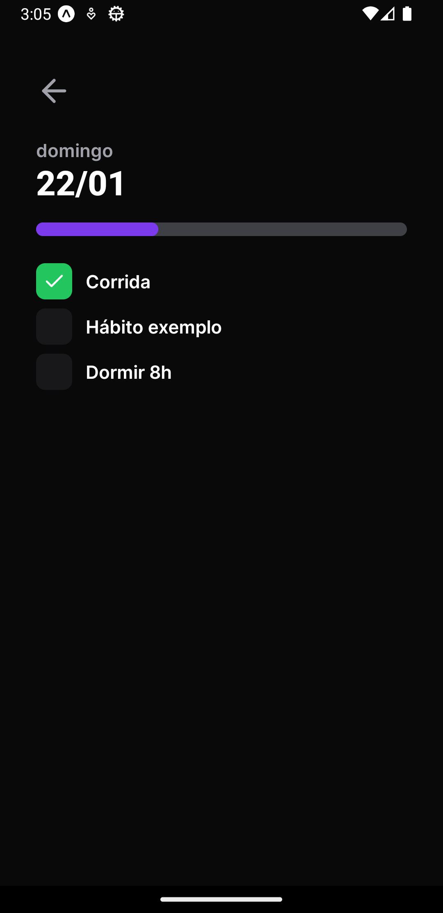
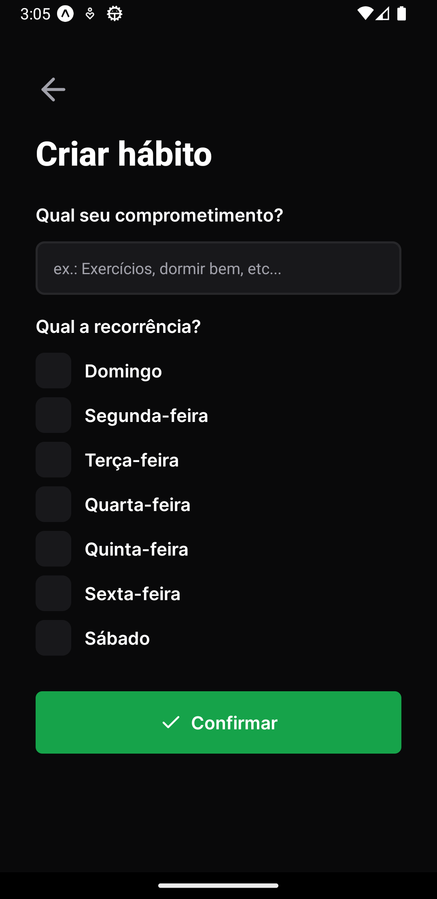
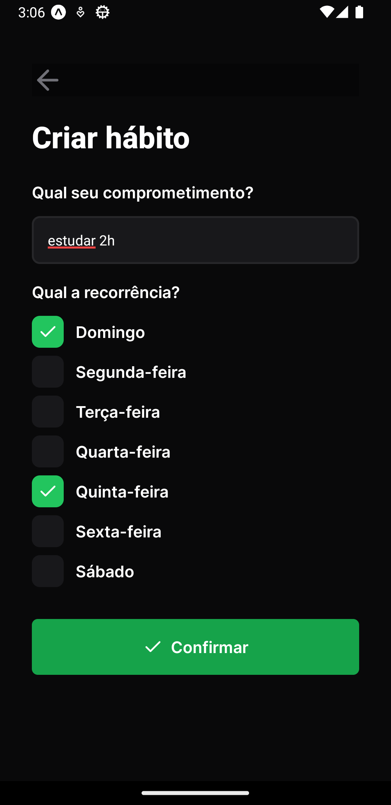

    

      
    

    
    
    
    
    

      
      
    

# 📷 Screenshots

  

    
    
    
    
  

# 📚 About Project

> Habits is an application that helps the users to controll new habits that they want to achieve. Using this application, they can see how many goals they achieved in each day, and then, adapt their routine to achieve more or less goals.

# 🚀 Running 

 To run this application, clone this repository by typing: `$ git clone https://github.com/raphaacosta/Nlw-Setup-Mobile.git`.
 - Go to the folder where you copied the repository
 - Type `$ cd Nlw-Setup-Mobile`
 - Install the dependencies: `$ npm install`.
 - Run `$ npx expo start`, you can scan the QRCode with your fisic device, or type `$ a` in your terminal, and the app will open in the opened android emulator)

# 📌 Techs

 - [Typescript](https://www.typescriptlang.org/)
 - [Node](https://nodejs.org/en/)
    - [Fastify](https://www.fastify.io/)
    - [Prisma](https://www.prisma.io/)
 - [React.js](https://pt-br.reactjs.org/)
    - [Tailwindcss](https://tailwindui.com/)
    - [Radix](https://www.radix-ui.com/)
    - [Phosphor Icons](https://phosphoricons.com/)
 - [React-Native](https://reactnative.dev/)
    - [Expo](https://expo.dev/)
    - [React Navigation](https://reactnavigation.org/)
    - [Reanimated](https://docs.swmansion.com/react-native-reanimated/)
    - [Nativewind](https://www.nativewind.dev/)

# 👍 Contribute

  If you find an bug, feel free to open an pull request or an issue.
  If you want to improve this project, just do it ➡️ :
  - Clone this repository: `$ git clone https://github.com/raphaacosta/Nlw-Setup-Mobile.git`.
  - Create a branch with your feature: `$ git checkout -b my-feature`.
  - Commit your changes: `$ git commit -m 'feat: my new feature'`.
  - Push your branch: `$ git push origin my-feature`.